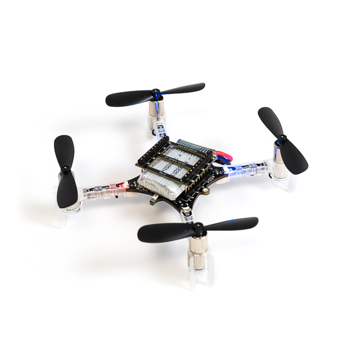

# Peripherals

This document specifically covers peripherals that come with the AI-deck rather than with the GAP8 itself and which have support implemented within this project.

## Camera

The AI-deck 1.1 targetted by this project comes with a Himax HM01B0-MNA grayscale camera mounted on the front of the device. It natively captures images at 324x324, although its effective resolution is only 320x320. The camera provides native acceleration for QVGA and QQVGA window scaling, cropping, vertical flip, and horizontal mirroring, thus offloading these tasks from the GAP8. It offers various programmable settings such as black level calibration, frame rates, exposure, and analog/digital gain. In addition, there's a motion sensor circuit which can send interrupts to the Fabric Controller once a certain threshold has been crossed. 

The GAP SDK contains bindings for the most generic and common features common to various camera BSP's used with the GAP8 such as turning on the camera, setting the resolution to QVGA/QQVGA, and taking pictures. Anything more though will likely require reading the vendor manual and manipulating hardware registers by hand since the Himax driver within the GAP SDK only really implements features common to other camera BSP's.

In theory the Himax can stream images at approximately 50 FPS, however, in practice, I (Edward) have only really been able to get around 15 FPS out of it, it's unclear whether this is due to limitations in the GAP SDK's driver implementation or if there's something else at play. Regardless, it might be worth it to write a custom driver implementation for the Himax within this project for testing purposes.

## WiFi

The AI-deck can either open up a WiFi access point or connect to an external WiFi access point over the NINA-W102 module. The NINA-W102 is based on the Xtensa variant of the ESP32 SoC, which supports 802.11b/g/n, and just like the GAP8, it can be flashed with a custom firmware image. [Bitcraze maintains a repository with their own ESP32 firmware variant written for the NINA based on the Espressif ESP-IDF SDK.](https://github.com/bitcraze/aideck-esp-firmware) Bitcraze's NINA firmware will retransmit JPEG/Bitmap images (provided to the NINA by the GAP8 over Bitcraze's CPX protocol) to any computers connected to it, which can be viewed using Bitcraze's image stream viewer. 

## The Crazyflie

This is the drone the AI-deck is attached to, it features an STM32F405 Cortex-M4 as its main MCU as well as an additional nRF51822 Cortex-M0 MCU responsible for radio and Bluetooth communications. The easiest method to communicate with the Crazyflie from the AI-deck and vice versa is via UART. [Bitcraze is working on a mailbox protocol known as CPX (also used for the NINA) to communicate between the GAP8, NINA, and main STM32.](https://www.bitcraze.io/2022/03/ai-deck-improved-infrastructure/)