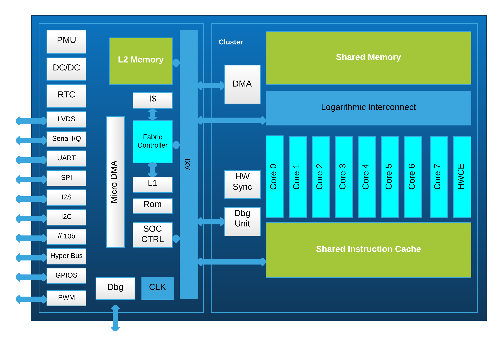
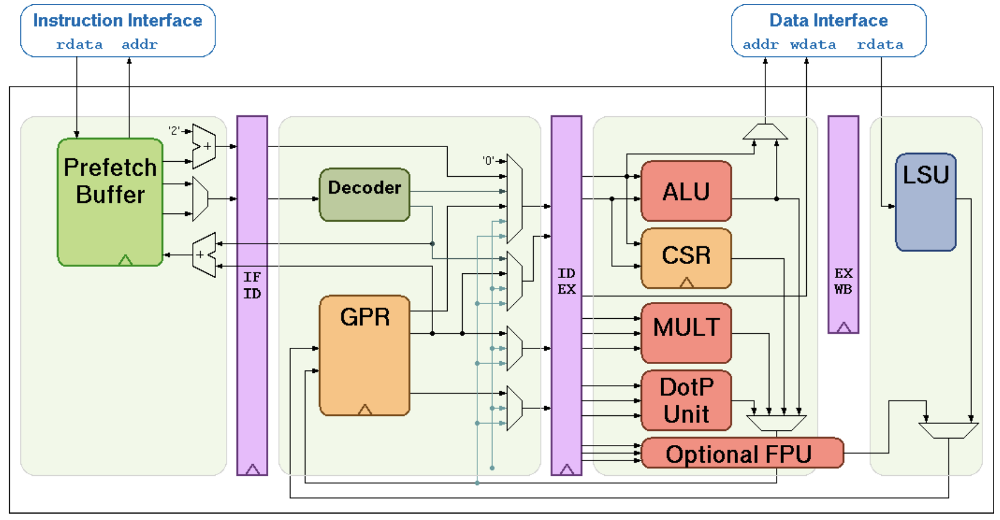

# GAP8

This document details various bits of information about the GAP8 processor on the AI-deck as it is used by this project. This is by no means an exhaustive list, for a much more detailed listing/explanation of the various GAP8 features, it's highly recommended one takes a look at [the official GAP8 manual](https://gwt-website-files.s3.amazonaws.com/gap8_datasheet.pdf). 

## The GAP8 Processor

*The GAP8 block diagram*

The GAP8 is an ultra low power 32 bit RISC-V processor which derives from the PULP (Parallel Ultra Low Power) project. It contains 9 CV32E40P cores, with one serving as the main application processor, and the remaining 8 serving as cluster cores which accelerate compute-intensive workloads. The Fabric Controller has direct control over the hardware and interfaces onboard the GAP8. The 8 cluster cores can be turned on/off as needed in order to save power.

## The CV32E40P Core

*The CV32E40P block diagram as seen in the RI5CY manual (note though that the internal implementation seen here isn't exactly the same as what's used within the GAP8)*

The main workhorse of the GAP8, this core was formerly known as the RI5CY when it was initially being developed by the PULP Project, but after its transfer to the OpenHW Group, is now known as CV32E40P. The CV32E40P is an in-order 4 stage 32-bit RISC-V core, implementing the Integer, Multiplication & Division, Floating Point, Compressed instructions, and custom Xpulp extensions. **However**, the CV32E40P as used by the GAP8 omits the floating point extension, and instead implements part of the supervisor mode extension along with some additional custom vector instructions. 

With 9 of these cores inside the GAP8, the processor is more than capable of real time edge inference-making, image postprocessing, cryptographic workloads, and more. In order to identify which core one is running on, one can use the functions pi_cluster_id() and pi_core_id() which will return one of the following values:

|ENTITY |CLUSTER ID | CORE ID |
| --- | --- | --- |
| CORE0 | 0x00 | 0x00 |
| CORE1 | 0x00 | 0x01 |
| CORE2 | 0x00 | 0x02 |
| CORE3 | 0x00 | 0x03 |
| CORE4 | 0x00 | 0x04 |
| CORE5 | 0x00 | 0x05 | 
| CORE6 | 0x00 | 0x06 |
| CORE7 | 0x00 | 0x07 |
| FC | 0x20 | 0x00 |

Somewhat confusingly, core 0 and the Fabric Controller share a core ID of 0. Despite them sharing the same core ID, they aren't the same core, the way to distinguish between them is to look at the cluster ID, which is 32 for the Fabric Controller, and 0 for the cluster cores. 

## Memory

The GAP8 has 3 different levels on its memory hierarchy.

The first is L1 memory, which is split, 64KB of it is available for both the cluster cores and Fabric Controller, and then 16KB of it is available for only the Fabric Controller. L1 memory is extremely fast, only requiring a single cycle to access in 98% of cases according to the GAP8 manual.

The second is L2 memory, there's a lot more L2 memory than there is L1 memory, with the GAP8 containing around 512KB of L2 memory, the tradeoff being that L2 memory is slower to use than L1 memory. It takes nearly 5-6 cycles to read/write to L2 memory. L2 memory is also connected directly to the rest of the peripherals and buses on the GAP8, so as a result, when communicating with external hardware, this is the memory you'll be using.

Finally, there's L3 memory, unlike L2 and L1 memory, this isn't directly addressable by the processor as it's connected either over the HyperBus or the SPI interface. What this means is, you can't just write to L3 memory directly through dereferencing a pointer in C. Instead, you'll have to use the micro-DMA unit to request reads/writes, with the data being read/written through L2 memory, although luckily this is abstracted through the API's available in the GAP SDK. Some other downsides to L3 memory besides it being more difficult to access are that it's both significantly slower than even L2 memory, and it also draws significantly more power, thus it's recommended to disable it as soon as you're done using it. The big upside though, is that one can attach a virtually unlimited amount of memory over L3, dozens of megabytes or more. The neural networks exported from NNTool/AutoTiler tend to make use of it for storing tensors and other associated data that simply can't be fit into L1 or L2 memory all at once.

Having said all of that though, it's probably possible to take advantage of C++'s language features to create an "L3 pointer" that pretends to be a regular memory mapped pointer. 

## Timers

The GAP8 has several timers, which are each fed by a variety of clock sources such as frequency locked loops (FLL), FLLs with a prescaler, a 32 kHz clock crystal, and external events. The actual timers available on the GAP8 are a rather confusingly described in the manual. It states there's 5 timers total, 4 advanced timers which each have 4 PWM outputs, as well as a single 32 bit SysTick timer. The 4 PWM timers make sense, however, there is no singular 32 bit SysTick timer, what this likely refers to is the 32 bit timer used by the Fabric Controller, as well as the other 32 bit timer used by the cluster cores as a group. These two 32 bit timers can be combined to form a 64 bit timer value. The Fabric Controller is the main timer used by this project, luckily the GAP SDK provides a simple wrapper for reading the current timer value, rt_time_get_us().

## UART

The GAP8 has a UART peripheral built right into it, although there doesn't seem to be any documentation on its available baudrates, it seems to be able to send at a rate of anywhere between around 100 to 625000 baud/second. Since it's ultimately just UART, there's not much to say about it other than that the GAP SDK contains API bindings for interacting with it.

## JTAG

This generally isn't too important, as with most JTAG implementations, it's simply used for uploading programs and debugging.

## I2C

Most microcontrollers include a I2C interface, and the GAP8 is no exception, in fact, the GAP8 has two of them. On the AI-deck, it's used by the Himax camera to transmit data to/from the GAP8. 

## SPI

Another common microcontroller interface is SPI, and the GAP8 also has two SPI interfaces. The GAP8 supports connecting HyperRAM and HyperFlash over the SPI interface, although on the AI-deck, these are connected via the HyperBus. On the AI-deck, the SPI interface is instead mainly used by the NINA WiFi/Bluetooth module to transmit/receive data to the GAP8.

## HyperBus

This is the interface through which external HyperRAM and HyperFlash are connected to the GAP8 on the AI-deck. The tradeoff between the HyperBus and the SPI is that although HyperBus has a higher bandwidth, 125mHz at maximum, it also suffers from higher latency, making it worse for small transfers. On the other hand, SPI has a lower bandwidth, only up to 50-60 mHz, although it has a lower latency, making it better than the HyperBus at small transfers. The AI-deck has 64 megabytes of HyperFlash and 8 megabytes of HyperRAM onboard.

As previously mentioned up this document, memory on the HyperBus isn't directly mapped into the GAP8's memory map, one instead has to submit commands manually in order to transfer data in and out of L3 memory to L2 memory before the GAP8 can begin to work with the data. 

## DMA Engines

There's several DMA engines within the GAP8, possibly the most important one is the Micro DMA engine as it has primary responsibility for transferring data between the various hardware interfaces and the L2 memory. The Micro DMA engine makes 8, 16, or 32 bit transfers, and it can transfer up to 128 kilobytes during a single transaction, it's responsible for the following transfer types: 

* LVDS from/to L2 
* Camera to L2 
* I2S0 to L2
* I2S1 to L2
* FC L1 from/to L2 
* I2C0 from/to L2 
* I2C1 from/to L2 
* UART from/to L2
* HyperBus from/to L2 
* SPIM0 from/to L2 
* SPIM1 from/to L2

In addition to Micro DMA, there's also the cluster DMA engine, which is responsible for transferring data between L1 and L2 memory. It allows submitting up to 16 1D/2D transfers at once between L1 and L2 memory, although it only has 8 duplexed channels.

## Hardware Convolution Engine

The Hardware Convolution Engine (HWCE) is a special purpose hardware accelerator designed to speed up the processing of, well, convolutions during neural network operation. The HWCE assumes a stride of 1, and it also assumes that all inputs and convolution weights are 4, 8, or 16 bit fixed point values. The HWCE shares access to L1 cluster memory with the cluster and Fabric Controller cores, although unlike the rest of the devices onboard the GAP8, it doesn't have access to L2 memory.