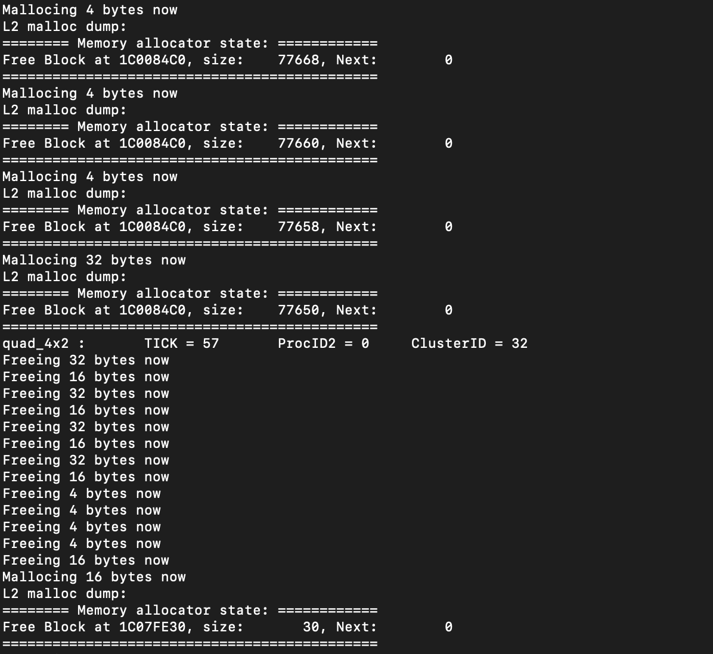

# Quirks

Some non-obvious issues that have been experienced while writing code for the GAP8, some of this is the typical sort of embedded quirks, others are a bit more specific to the GAP8.

## JTAG Cable Usage

Bitcraze is working on a method of flashing the GAP8 and NINA OTA using WiFi and/or the Crazyradio, however it's still not fully complete so for now, the JTAG cable is still a necessity for doing much of anything with the AI-deck. Unfortunately, the JTAG cable seems to be a bit buggy, *especially* when taking power measurements. Sometimes the flasher will error out and report it's receiving all zero's or all one's when you attempt to flash an image. Usually when this happens, you'll have to manually kill the various processes launched by the flasher, as well as turn off the Crazyflie/AI-deck, disconnect the AI-deck, reconnect it, then turn it back on. However, this doesn't always solve the issue, especially if you have the AI-deck/Crazyflie partly disassembled for taking power measurements. In the latter case, the only known fix is to effectively pull apart the whole entire power measurement setup, disconnecting every wire, and then reconnecting all of them.

## SDK

As mentioned within [Toolchain.md](Toolchain.md), don't use the Bitcraze Docker image if you intend on doing anything with neural networks, the version of NNTool and AutoTiler that the Docker image ships with are out of date and have their fair share of bugs. 

## OS'

The GAP8 has 3 different OS' available as of the time of writing, PMSIS, FreeRTOS, and PULP-OS. All of them are RTOS', and all of them are rather barebones, only really providing a thin wrapper around the hardware. This project uses the PMSIS OS. The only thing to really say about these is that although at a very high level glance their API's somewhat resemble API's you might see on a traditional desktop OS, they usually aren't the same, and there's often somewhat hidden gotchas. Thus, be careful to read the API docs and/or look at the implementation, before using a set of functions.

## Memory Ordering

[This article is highly recommended](https://preshing.com/20120930/weak-vs-strong-memory-models/), but to sum it up, memory ordering is essentially the order in which CPUs make reads and writes to memory, and the order in which those reads/writes become visible to other processors. As the GAP8 is based on the RISC-V architecture, it, like the majority of RISC-V cores, is weakly ordered. Although for 90% of the code you write this won't be an issue, if you're trying to directly manipulate the GAP8's hardware and peripherals without using the GAP SDK's API's, or you're actively sharing variables in memory between cores, this is something you'll have to be aware of. 

Yet another challenge that adds onto this is that L2 memory is slow, if you write a value and then immediately try to read/write that value from another core, don't necessarily expect the other core to correctly "see" that value until it has finished being sent to RAM.

## Stack Allocation

Several issues to be aware of, for one thing, when calling a GAP SDK function that takes in a pointer to a struct in memory, make sure that that struct is allocated in the correct part of memory. Some functions expect the struct to stick around for a long period of time, and allocating a struct on the stack doesn't exactly guarantee this, as stack allocated variables tend to be destroyed at the end of the function call they're allocated in. I (Edward) had an issue while experimenting with FreeRTOS where my program kept randomly hitting access errors for seemingly no reason, and it turned out that it was because I was allocating a task struct on the stack, which was immediately being cleared the moment the program jumped into the new task. 

A second thing to be aware of, the default stack sizes used by the GAP8's Fabric Controller and it's cluster cores are very small, around 4KB for the Fabric Controller and only a single KB for each of the cluster cores. Depending on what you're doing, especially if you're using any neural networks, these stack sizes may have to be adjusted. Do be careful though that if you're using an AutoTiler model, you adjust the L1 memory available to the model as well as the stack size, otherwise the AutoTiler model may end up trying to read/write data meant for the heap onto stack memory and cause corruptions.

A final thing to be aware of is that the stack for both the Fabric Controller and cluster cores is located within L1 memory. As such, if talking to any peripherals or buses and you want to send stack data, you'll need to copy that data from the stack into L2 memory first.

## PMSIS API Heap Allocation

For real time applications, you generally shouldn't ever allocate or free memory using a standard heap allocator during program execution except during program startup and shutdown. However, when you do allocate memory, be extremely careful that you free any allocations you make in LIFO order. If you don't, the PMSIS heap allocator will lose track of its free space and likely cause an allocation failure next time you try making an allocation. As an example, if you allocate 3 objects, but then you free the second object before freeing the other objects, your next allocation will likely fail.

*In this example, various objects were allocated but then freed out of the order they were allocated in, as you can see, the PMSIS API's heap allocator essentially "forgot" it had hundreds of kilobytes free*

## Specifying Tasks For Cluster Cores

An initial assumption one might have when first seeing the GAP8 is assuming that one can dynamically schedule tasks across all the cores, similar to desktop processors, however, this isn't really the case. The GAP8 is much closer to the Cell Broadband Engine than any sort of desktop CPU, one submits tasks for execution on the cluster cores, and then the result gets returned to the Fabric Controller. The custom GreenWaves GCC fork provides a CFLAG for controlling the number of cluster cores used at maximum, -mPE=x. 

## Atomic Operations

The default libgcc atomic operations aren't supported by the GAP8, attempting to use them will result in the program failing to link since there simply aren't any atomic operations implemented in libgcc. The GAP8 manual mentions one can use the L1 memory region for atomic operations, although I (Edward) haven't explored how to use this as of yet.

## Synchronization Primitives

The GAP SDK provides spinlocks, mutexes, etc. although for whatever reason, as of the time of writing, none of them appear on the official GreenWaves API docs. Thus, if you'd like to use a synchronization primitive that doesn't have a C++ wrapper already implemented, it's recommended to search for examples of how it's used within the GAP SDK.

## Neural Networks

NNTOOL and AutoTiler have a number of rough edges, both can be prone to failing in both spectacular and subtle ways, and it can be extremely difficult to figure out exactly why, especially since AutoTiler in particular is closed source and there's not a whole ton of documentation. As such, getting them to work properly can require a ***lot*** of trial and error. Luckily, most of the flags and commands you pass to each of the tools have been abstracted away in Meson, however, some issues you'll likely face are as follows: the resultant on-device neural network not working at all, as in, returning the same inference for every input, AutoTiler crashing while generating the C code for the on-device neural network, or, the neural network running out of stack space during execution. The first issue still hasn't been narrowed down, I'm (Edward) not currently sure if the cause is the weights not being loaded correctly, if it's a bug in NNTOOL/AutoTiler, or if there's something else going on. As for the second issue, a fix that has been found is that tweaking the amount of L1/L2/L3 memory being allocated in the root Meson build script can help. For whatever reason, AutoTiler will sometimes segfault if it can't allocate enough space for a neural network at a given node in the neural network's execution graph. The third, somewhat related issue, is tweaking the amount of stack space allocated for both the Fabric Controller and cluster cores, there's several preprocessor macros to tweak in the root Meson build script:

```
STACK_SIZE
SLAVE_STACK_SIZE
RT_FC_STACK_SIZE
```

SLAVE_STACK_SIZE is obvious, it controls how much stack space the cluster cores have, on the other hand, it's not entirely clear what the difference is between STACK_SIZE and RT_FC_STACK_SIZE, one would expect them to have the same usage, however, looking through the GAP SDK, they both appear to have different usages. **Be careful to also lower the amount of L1 memory available to AutoTiler by the amount of stack space you allocate, or else the neural networks will overwrite stack memory.**

## Color Camera Outputting Grayscale Images?

This is an issue GreenWaves has [acknowledged](https://www.bitcraze.io/2020/07/ai-deck-sees-in-color/). However, if you're pretty sure you have a color camera, but the debayering isn't working, check your camera. As in, detach it from the AI-deck and look at the model name written on the camera's sensor connector. Color cameras should have **608H_A** written on them, whereas the monochrome cameras will have **608H-1_A**. Apart from the model names, both cameras otherwise look almost exactly identical so it's normally impossible to just tell which camera is which by looking at it when it's mounted on the AI-deck. 