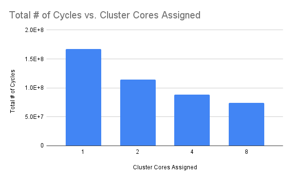
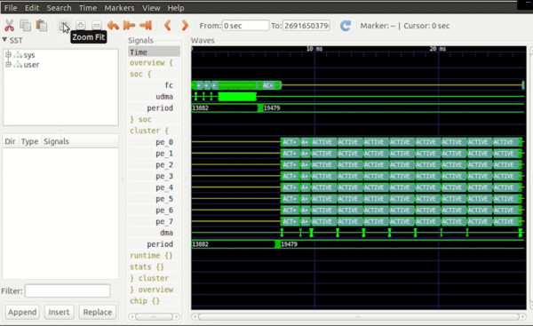
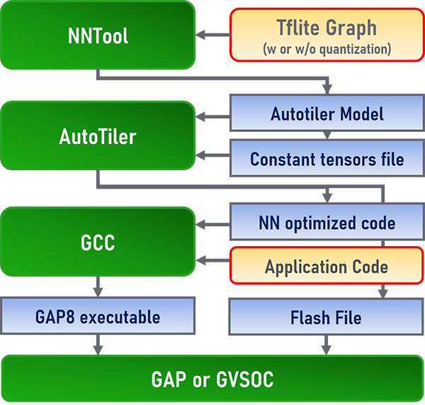

# Toolchain

## Background

There's a Docker image published by Bitcraze which has an entire GAP SDK + Toolchain instance setup inside of it, and although it works for simple applications, the GAP SDK it uses is, at least as of the time of writing, extremely out of date by a year or so. This caused plenty of headaches when attempting to begin exporting neural networks for the GAP8, so as a result, it is highly recommended one downloads and installs the latest GAP SDK along with the various bits required to use it, like GreenWaves' compiler and linker.

## Uploading Programs to the AI-deck

Bitcraze is currently working on a method of enabling the user to flash the GAP8 and NINA processors remotely via WiFi, however, it isn't fully functional yet (as of April 30th, 2022), so in order to flash the GAP8, one will need a JTAG cable of some sort to connect to the GAP8 and NINA's headers. 

## Setting Up The Toolchain

This repository contains a bash script that will automatically download, compile, and install the GAP SDK, GCC, Binutils, Embedded Template Library, and GoogleTest into this project directory. Unfortunately, as the script is somewhat cobbled together just like the rest of the project, it isn't very robust. If the build fails for any reason, you're likely going to either have to continue the rest of the build by hand, or delete the intermediate files and restart the build script.

The detailed build instructions are located within [Build.md](Build.md).

## GCC & Binutils

As the GAP8 contains some nonstandard extensions, GreenWaves Technologies maintains a custom fork of GCC 7.1.1 and Binutils 2.28, both of which are somewhat out of date at this point. Ideally LLVM can gain codegen support for the GAP8's custom instructions and compiler options at some point, but failing that, there's an up to date fork of GCC and Binutils maintained for the CV32E40P core used by the GAP8 which could possibly be adapted. 

Returning to GreenWaves' GCC, the main features to be aware of is that, first, one can specify the number of cluster cores available for cross compilation using the -mPE=X CFLAG, with X being the number of cluster cores one wants to use, it can range anywhere between 1 and 8. 

*The effect that changing the number of available cluster cores using the -mPE flag had on the runtime of a neural network*

Something else is that especially when doing anything using AutoTiler generated code, including neural networks, it's highly recommended that your compiler optimization level is set to -O3. Modern compilers are extremely good at performing loop nest optimization, vectorization, and loop unrolling, and this is absolutely noticeable when working with the compute kernels that GreenWaves offers, as GCC will not only perform its own standard passes, but it will make aggressive use of the GAP8's custom instructions to eke out as much performance as possible. As an example, in one case, changing the compiler optimization level from -O0 to -O3 improved the performance of a neural network executing on the GAP8 by over two times, with it dropping from roughly 170 million cycles to operate to completion, to only around 70 million cycles. 

## C++ Embedded Template Library

Although the BuildToolchain.sh script compiles g++ with libstdc++ enabled, libstdc++ mostly doesn't work as the Newlib port to the GAP8 is incomplete. As such, apart from std::initializer_list, this project doesn't use any of the C++ standard library and instead uses the Embedded Template Library (ETL). As the name would suggest, the ETL is designed to be a sort of C++ standard library replacement optimized for embedded microcontrollers like the GAP8. Fortunately, despite the constraints faced by programming for microcontrollers, the ETL manages to provides a reimplementation of large portions of the most commonly used parts of the C++ standard library.

## GAP SDK

The main repository of software for interfacing with the GAP8 as well as the AI-deck's hardware, this contains implementations written in C of hardware drivers, math functions, image encoding functions, and more. In addition to the GAP8 code, the GAP SDK contains several tools which will be discussed in further detail below. Unfortunately, the GAP8 headers weren't really designed with C++ in mind, they completely fail to compile under C++ unless one uses GNU extensions and also passes -fpermissive in the compiler flags. Even with this though, g++ will still emit plenty of warnings in any C++ source file that uses these GAP8 headers, since unlike other warnings, -fpermissive's warnings can't be turned off using custom pragma's. This can be fixed by patching the GAP8 headers for C++ compatibility, although as of right now, this hasn't been attempted yet.

## GVSOC

This is a full system emulator for the GAP8, and it attempts to provide cycle accurate emulation of not just the GAP8's CV32E40P cores, but also the various internal interfaces and peripherals it contains. It even provides shims for a few common external peripherals such as cameras and displays. It's actually pretty good at emulating the GAP8, and its debugging capabilities aren't too shabby either, it can provide instruction traces of the various cores at runtime, as well as log not just these instruction traces, but also hardware traces to a file to view hardware state at a particular time after execution within the GTKWave tool. 

*Viewing a GAP8 trace under GTKWave*

GVSOC does have some limited GDB support, with the ability to inspect registers and memory and the like, although it has some bugs relating to compressed instructions, and by default it assumes that the program is 64 bit rather than 32 bit. 

## AutoTiler

This is a rather interesting program, and seems to be one of GreenWaves' "killer apps" for the GAP8 along with NNTOOL. It's a code generator that automatically generates C source files for compute tasks, and it is designed to allow programmers to write code for compute tasks without having to directly worry about memory availability while writing these compute tasks. It will automatically perform the work of optimizing memory transfers between different areas on the memory hierarchy according to given constraints such as the total amount of available memory at runtime.

AutoTiler comes as a (sadly) proprietary library compiled for amd64 Linux with glibc. To use it, you simply write a model specification with the required constraints in C/C++, compile it with your host compiler, then link it against the AutoTiler library. As this is a code generator, it runs on your host computer, and once it's finished executing, you should have several C source files that you can then treat as if they were hand written source files for the GAP8. 

These generated C source files are based on prewritten compute kernels, GreenWaves provides a range of kernels for various tasks such as neural network transformations, linear algebra operations, bilinear image resizing, and more. It's also possible to write custom compute kernels, they will need both a host component, that specifies how to pass arguments into the GAP8 compute kernel functions, as well as a GAP8 component that will be the source code that is compiled for the GAP8. [A more complete explanation of both AutoTiler and how to write custom kernels for it is located here.](https://greenwaves-technologies.com/manuals/BUILD/AUTOTILER/html/index.html)

Yet another cool feature is that one doesn't necessarily need to compile and run these generated C source files on the GAP8, GreenWaves provides some compatibility functions that allow one to run these generated models as an i386 Linux binary (you will more than likely need to install some compatibility libraries and headers in order to perform this step).

## NNTOOL

NNTOOL is a program GreenWaves developed that assists in the process of exporting TensorFlow Lite or ONNX neural networks to execute on the GAP8. It works by creating a model specification that one can then compile against AutoTiler to create a generator that allows one to then export this neural network for the GAP8 according to given memory constraints. Essentially, the process looks like the following:

NNTOOL can be run either as a CLI program that the user can interact with and run commands in, or it can be scripted using the same commands, just in a text file that is passed into NNTOOL's argv. Both this project and the GAP SDK's Makefiles take full advantage of the scripting functionality, and it's been automated as part of the build process in both. 

NNTOOL provides a plethora of options for working with neural networks, it performs several steps such as trimming or combining unsupported or redundant neural network layers, and it also handles quantization settings automatically, which is important for embedded devices, especially ones like the GAP8 which don't have floating point support in hardware. 

For more information about NNTOOL and it's supported operations, visit these two links, [the NN Quick Start Guide](https://greenwaves-technologies.com/sdk-manuals/nn_quick_start_guide/), and [the NNTOOL Docs](https://github.com/GreenWaves-Technologies/gap_sdk/tree/master/tools/nntool).

## GoogleTest

Currently GoogleTest isn't used by this project at all, although, in the future, it'd be useful to use it to provide source code coverage and verify program behavior on host computers rather than having to run the full program in GVSOC or on a physical AI-deck device.

## Meson & Ninja

Unlike the standard GAP SDK, this project uses Meson to generate a Ninja build system for compiling both the host applications such as the AutoTiler code generators, and also the actual GAP8 source files. This has its benefits and downsides, in terms of benefits, it allows significantly greater flexibility, as every aspect of the build can be customized. It also allows for better compile parallelization compared to Make, and is [faster than Make](http://neugierig.org/software/chromium/notes/2011/02/ninja.html). Of course the downside is that moving to newer GAP SDK revisions is significantly more painful, as it'll be on this project to figure out what's changed in the GAP SDK between releases, i.e., have any source code directories been moved, or is there a new compiler flag we need to pass? 

## NINA & Crazyflie Programming

As of right now, this project only really contains code and a toolchain setup for the GAP8 processor. As such, if you want to write code for the NINA or the Crazyflie's STM32, you'll need to download their SDK's and toolchains separately.